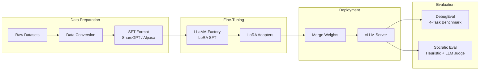
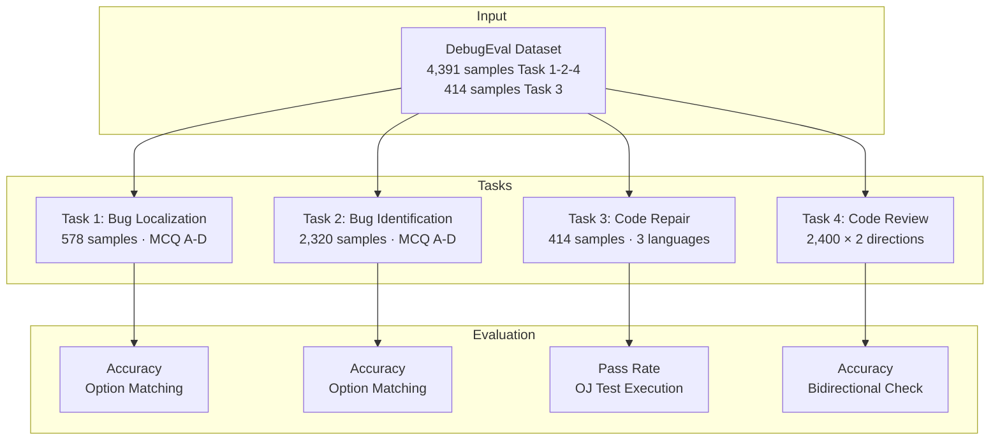
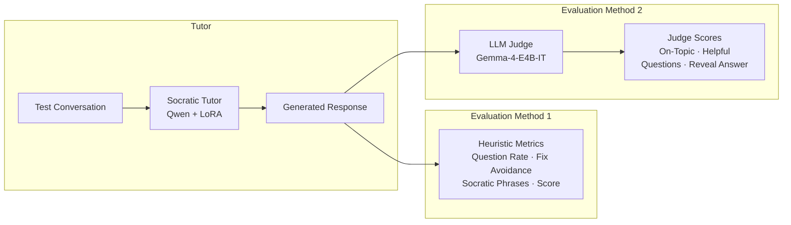

<div align="center">

# 🔬 Parameter-Efficient Fine-Tuning for Code Debugging and Socratic Tutoring

**LoRA-based SFT of Gemma-4 and Qwen2.5 Models on DebugEval & Socratic Debugging Benchmarks**

[](https://huggingface.co/ntduc0901)
[](https://github.com/hiyouga/LLaMA-Factory)
[](https://github.com/vllm-project/vllm)
[](https://github.com/COAST-benchmark)

</div>

---

## 📋 Table of Contents

- [Overview](#overview)
- [Key Results](#key-results)
- [Architecture](#architecture)
- [Project Structure](#project-structure)
- [Setup](#setup)
- [Usage](#usage)
- [Evaluation](#evaluation)
- [Documentation](#documentation)
- [License](#license)

---

## Overview

This repository provides a complete pipeline for **parameter-efficient fine-tuning (PEFT)** and evaluation of large language models on two distinct tasks:

| Task | Objective | Benchmark |
|:---|:---|:---|
| **Code Debugging** | Localize, identify, repair, and review bugs in code | [DebugEval (COAST)](https://github.com/COAST-benchmark) |
| **Socratic Tutoring** | Guide students to discover bugs through questioning | Socratic Debugging Dataset |

We fine-tune three base models using **LoRA (Low-Rank Adaptation)** via [LLaMA-Factory](https://github.com/hiyouga/LLaMA-Factory) and evaluate them through a comprehensive multi-task benchmark suite.

### Models

| Base Model | Parameters | Task | LoRA Targets | Trainable % |
|:---|:---:|:---|:---|:---:|
| **Gemma-4-E4B-IT** | 7.96B | DebugEval | `q_proj`, `v_proj` | 0.23% |
| **Qwen2.5-Coder-3B-Instruct** | 3.21B | DebugEval | All linear layers | 3.74% |
| **Qwen2.5-3B-Instruct** | 3.21B | Socratic Tutoring | All linear layers | 3.74% |

---

## Key Results

### DebugEval Benchmark

```
Task 1: Bug Localization    ── Select the erroneous code snippet (4-option MCQ)
Task 2: Bug Identification  ── Classify the bug type (4-option MCQ)
Task 3: Code Repair         ── Generate corrected code (judged by test execution)
Task 4: Code Review          ── Identify buggy snippet between two alternatives
```

#### Performance Comparison

```
                        Task 1          Task 2          Task 3          Task 4
                      Localization   Identification    Repair          Review
                     ─────────────  ─────────────── ────────────── ──────────────
  Gemma4 Base     │   79.24%           55.43%          8.94%          N/A*
  Gemma4 + LoRA   │   73.01%           44.61%         41.30%  ▲×4.6  86.65%
                  │
  Qwen Base       │   44.29%           25.43%         34.30%         83.38%
  Qwen + LoRA     │   71.45%  ▲+27    43.79%  ▲+18   44.69%  ▲+10  83.75%
                     ─────────────  ─────────────── ────────────── ──────────────

  * Gemma4 Base Task 4 evaluation was interrupted and did not produce a final result.
  ▲ indicates notable improvements after fine-tuning.
```

#### Key Findings

> **Finding 1**: Qwen Coder + LoRA achieves **uniform improvement across all 4 tasks** with no degradation, making it the most balanced configuration.

> **Finding 2**: Gemma4 + LoRA shows a **specialization trade-off** — Code Repair improves 4.6× but comprehension tasks degrade by 6–11 pp.

> **Finding 3**: After fine-tuning, both models **converge to similar performance** (within ~3 pp), despite vastly different base capabilities.

### Socratic Tutoring Evaluation

```
┌──────────────────────────────────────────────────────────────┐
│                  Socratic Tutor Quality                       │
│                                                              │
│  ███████████████████████████████████████████  96.1%           │
│  Question Rate (asks guiding questions)                      │
│                                                              │
│  ████████████████████████████████████████████ 100.0%          │
│  Answer Concealment (avoids revealing fixes)                 │
│                                                              │
│  ████████████████████████████████████████████ 4.93/5          │
│  On-Topic Relevance (LLM Judge)                              │
│                                                              │
│  ██████████████████████████████████████████   4.49/5          │
│  Helpfulness (LLM Judge)                                     │
│                                                              │
└──────────────────────────────────────────────────────────────┘
```

---

## Architecture

### Training & Evaluation Pipeline



### DebugEval Task Pipeline



### Socratic Evaluation Pipeline



---

## Project Structure

```
.
├── 📁 data/                        Datasets
│   ├── debugeval/
│   │   ├── raw/                    Raw DebugEval JSONL files
│   │   ├── sft/                    SFT training data (24,892 samples)
│   │   └── atcoder_cases/          Test cases for code repair (Input/Output)
│   └── socratic/
│       ├── raw/                    Raw Socratic debugging conversations
│       └── sft/                    ShareGPT format (552 train / 77 test)
│
├── 📁 models/                      Model weights (git-ignored)
│   ├── base/                       Downloaded base models
│   └── finetuned/                  LoRA adapters & merged weights
│       ├── debugeval/              Gemma4-SFT, Qwen-Coder-SFT
│       └── socratic/               Qwen-Instruct-SFT
│
├── 📁 configs/                     Training configurations
│   ├── debugeval/                  gemma4_sft.sh, qwen_coder_sft.sh
│   └── socratic/                   qwen_instruct_sft.sh
│
├── 📁 scripts/
│   ├── serve/                      vLLM serving scripts
│   ├── eval/                       Evaluation scripts
│   │   ├── run_debugeval.py        DebugEval 4-task benchmark
│   │   ├── run_socratic_eval.py    Heuristic Socratic evaluation
│   │   └── evaluate_with_gemma_judge.py  LLM-as-Judge evaluation
│   └── utils/                      Data conversion & model management
│
├── 📁 logs/                        Experiment logs
│   ├── training/                   Training loss curves & metrics
│   └── evaluation/                 Evaluation results & reports
│
├── 📁 docs/                        Scientific reports
│   ├── 01_gemma4_base_vs_finetune_debugeval.md
│   ├── 02_qwen_coder_base_vs_finetune_debugeval.md
│   ├── 03_cross_model_comparison_debugeval.md
│   └── 04_qwen_socratic_finetune_evaluation.md
│
├── 📁 COAST/                       COAST benchmark framework (prompts & tools)
└── 📁 tools/                       LLaMA-Factory (training framework)
```

---

## Setup

### Prerequisites

- Python 3.10+
- CUDA-compatible GPU (≥24GB VRAM recommended)
- [vLLM](https://github.com/vllm-project/vllm) for model serving
- [LLaMA-Factory](https://github.com/hiyouga/LLaMA-Factory) (included in `tools/`)

### 1. Configure Hugging Face Token

The fine-tuned LoRA adapters are hosted on [Hugging Face](https://huggingface.co/ntduc0901). Set your token to enable downloads:

```bash
export HF_TOKEN="your_huggingface_token"
```

### 2. Download Base Models

Downloads Gemma-4-E4B-IT, Qwen2.5-Coder-3B-Instruct, and Qwen2.5-3B-Instruct:

```bash
bash scripts/utils/download_base_models.sh
```

### 3. Download LoRA Adapters

Downloads the fine-tuned LoRA weights from Hugging Face:

```bash
bash scripts/utils/download_lora_adapters.sh
```

### 4. Prepare DebugEval Dataset

Downloads and extracts the DebugEval benchmark data:

```bash
bash scripts/utils/download_debugeval_data.sh
```

> **Note**: The Socratic dataset (`data/socratic/`) is included in the repository and does not require additional download.

---

## Usage

### Training

Fine-tune models using LLaMA-Factory with LoRA:

```bash
# ─── DebugEval Task ──────────────────────────────────────
bash configs/debugeval/gemma4_sft.sh           # Gemma-4-E4B-IT
bash configs/debugeval/qwen_coder_sft.sh       # Qwen2.5-Coder-3B-Instruct

# ─── Socratic Tutoring Task ──────────────────────────────
bash configs/socratic/qwen_instruct_sft.sh     # Qwen2.5-3B-Instruct
```

#### Training Hyperparameters

| Parameter | DebugEval (Gemma4) | DebugEval (Qwen) | Socratic (Qwen) |
|:---|:---:|:---:|:---:|
| LoRA Rank | 64 | 64 | 64 |
| LoRA Alpha | 128 | 128 | 128 |
| Learning Rate | 5e-5 | 5e-5 | 2e-5 |
| Epochs | 2 | 2 | 5 |
| Effective Batch Size | 16 | 16 | 8 |
| Cutoff Length | 2048 | 2048 | 2048 |

### Serving

Deploy models via vLLM for inference:

```bash
# ─── Base Models ─────────────────────────────────────────
bash scripts/serve/serve_gemma4_base.sh        # Gemma4 base (port 8888)
bash scripts/serve/serve_qwen_coder_base.sh    # Qwen Coder base (port 8888)

# ─── Fine-Tuned Models ──────────────────────────────────
bash scripts/serve/serve_gemma4_finetuned.sh   # Gemma4 + LoRA merged
bash scripts/serve/serve_qwen_coder_lora.sh    # Qwen Coder + LoRA (native)
bash scripts/serve/serve_qwen_instruct_merged.sh  # Socratic Tutor merged

# ─── Judge Model ─────────────────────────────────────────
bash scripts/serve/serve_gemma4_judge.sh       # Gemma4 as Socratic judge
```

---

## Evaluation

### DebugEval Benchmark

Evaluates models across 4 debugging tasks using COAST prompt templates:

```bash
# Base model evaluation
python scripts/eval/run_debugeval.py \
    --model-type qwen \
    --port 8888

# Fine-tuned model evaluation
python scripts/eval/run_debugeval.py \
    --model-type qwen-sft \
    --port 8888

# Available model types: qwen, qwen-sft, gemma, gemma-sft
```

### Socratic Tutoring Evaluation

**Method 1 — Heuristic Metrics:**
```bash
python scripts/eval/run_socratic_eval.py \
    --api-url http://localhost:8001 \
    --model-name socratic-tutor
```

**Method 2 — LLM-as-Judge (Gemma-4):**
```bash
python scripts/eval/evaluate_with_gemma_judge.py \
    --tutor-url http://localhost:8001/v1 \
    --judge-url http://localhost:8002/v1
```

---

## Documentation

Detailed scientific reports are available in the [`docs/`](docs/) directory:

| Report | Description |
|:---|:---|
| [Gemma4 Base vs. Fine-Tuned](docs/01_gemma4_base_vs_finetune_debugeval.md) | Impact of LoRA on Gemma-4-E4B-IT across 4 DebugEval tasks |
| [Qwen Coder Base vs. Fine-Tuned](docs/02_qwen_coder_base_vs_finetune_debugeval.md) | Impact of LoRA on Qwen2.5-Coder-3B-Instruct |
| [Cross-Model Comparison](docs/03_cross_model_comparison_debugeval.md) | Comprehensive comparison of all 4 configurations |
| [Socratic Tutor Evaluation](docs/04_qwen_socratic_finetune_evaluation.md) | Dual evaluation (heuristic + LLM judge) of Socratic tutoring quality |

---

## Fine-Tuned Model Weights

LoRA adapters are available on Hugging Face:

| Model | Repository |
|:---|:---|
| Gemma-4 DebugEval LoRA | [`ntduc0901/gemma4-debugeval-lora`](https://huggingface.co/ntduc0901/gemma4-debugeval-lora) |
| Qwen Coder DebugEval LoRA | [`ntduc0901/qwen-debugeval-lora`](https://huggingface.co/ntduc0901/qwen-debugeval-lora) |
| Qwen Socratic LoRA | [`ntduc0901/qwen-socratic-lora`](https://huggingface.co/ntduc0901/qwen-socratic-lora) |

---

## Acknowledgments

- [LLaMA-Factory](https://github.com/hiyouga/LLaMA-Factory) — Efficient fine-tuning framework
- [vLLM](https://github.com/vllm-project/vllm) — High-throughput LLM inference engine
- [COAST Benchmark](https://github.com/COAST-benchmark) — DebugEval evaluation suite and prompt templates
- [Google DeepMind](https://deepmind.google/) — Gemma-4 model
- [Alibaba Cloud](https://qwenlm.github.io/) — Qwen2.5 model family
